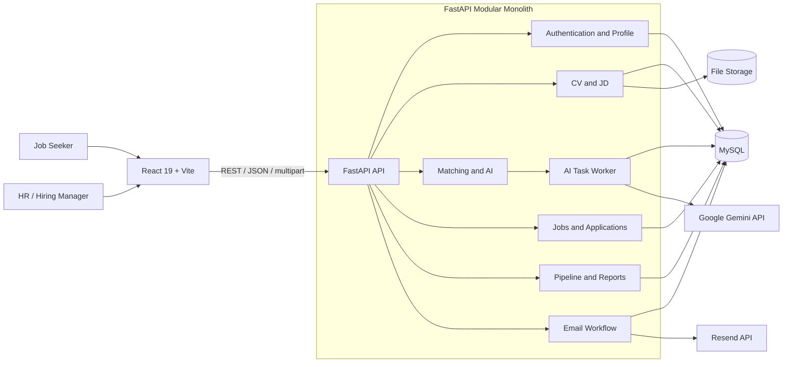
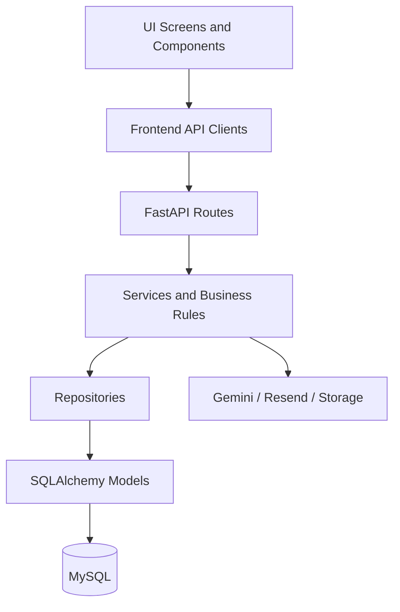
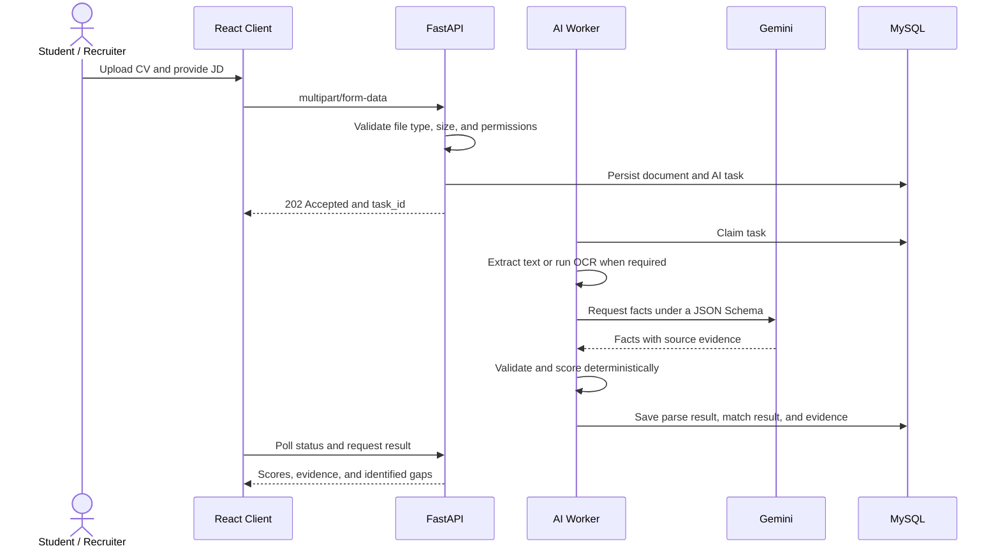
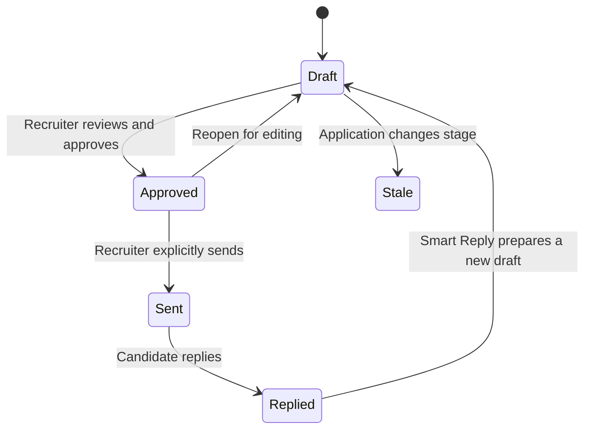

# FitCV — AI-Assisted CV Screening and Job Readiness Platform

> An academic course project that helps job seekers improve their applications and enables recruiters to screen candidates using evidence-grounded AI assistance.

FitCV connects two user groups in one integrated platform:

- **Students / Job Seekers** manage CVs, analyze their fit against job descriptions (JDs), receive improvement suggestions, search for jobs, and track applications.
- **HR Professionals / Recruiters** manage job posts, rank CVs, operate hiring pipelines, prepare review-first candidate emails, and examine recruitment reports.

AI is used to **extract evidence and support decisions**, not to replace human judgment. FitCV scores are advisory indicators; the system never automatically accepts or rejects a candidate.

## Table of Contents

- [Project Objectives and Scope](#project-objectives-and-scope)
- [Team Members](#team-members)
- [Core Features](#core-features)
- [System Architecture](#system-architecture)
- [Business Workflows](#business-workflows)
- [Technology Stack](#technology-stack)
- [Repository Structure](#repository-structure)
- [Local Setup](#local-setup)
- [Testing and Verification](#testing-and-verification)
- [Development Process](#development-process)
- [Security, Privacy, and Limitations](#security-privacy-and-limitations)
- [Future Work](#future-work)

## Project Objectives and Scope

### Problem Statement

Job seekers often struggle to determine whether a CV adequately addresses a job description. At the same time, recruiters must review large numbers of inconsistently structured applications while keeping hiring decisions transparent and explainable.

### Academic Objectives

This project demonstrates the analysis, design, and implementation of a full-stack web application with responsible AI integration:

1. Analyze requirements for two user groups and enforce role-based authorization.
2. Design a modular monolith, REST API, and relational database.
3. Build an asynchronous pipeline for PDF/DOCX processing and AI tasks.
4. Combine semantic extraction with deterministic, evidence-grounded scoring.
5. Apply testing, security, personal-data protection, and human-in-the-loop principles.

### MVP Scope

- Authentication, Google sign-in, role selection, and session management.
- CV/JD upload, storage, extraction, and analysis.
- Evidence-grounded improvement suggestions and CV rebuilding.
- Job-post and application management.
- CV ranking for external batches and applications submitted through FitCV.
- Recruitment pipeline, candidate email, and reporting workflows.

## Team Members

| Member | Primary Role | Main Responsibilities |
|---|---|---|
| **Le Phuc Khang** | Team Lead / Integration | Architecture, integration, authentication, and deployment coordination |
| **Nguyen Duong Gia Thuan** | Developer — Student Portal | Analyzer, Application Tracker, JD Library, and CV History |
| **Nguyen Kieu Anh Quan** | Developer — HR and AI Workflows | AI Suggestions, Job Posts, Pipeline, and Auto Email |
| **Duong Anh Kiet** | Business Analyst / Tester | Requirements, test cases, dashboards, and report validation |

> The table identifies primary ownership. Changes are still reviewed and integrated at the system level.

## Core Features

### Student / Job Seeker Portal

- Register, sign in, use Google OAuth, and recover passwords with a six-digit verification code.
- Manage profiles and CVs; accept PDF/DOCX uploads up to 10 MB.
- Compare a CV with a JD through the shared matching engine.
- Review the overall score, category scores, supporting evidence, and skill gaps.
- Receive grounded improvement suggestions and rebuild a CV.
- Search for jobs, save JDs, and track application progress.

### HR / Hiring Manager / Admin Portal

- Create, update, publish, close, and archive job posts.
- Rank up to 20 externally sourced CVs against an HR-provided JD.
- Rank candidates who applied to a company job through FitCV.
- Review raw CVs alongside parsed facts and scoring evidence.
- Manage the pipeline stages: Applied, Screening, Interview, Offer, Hired, and Rejected.
- Prepare candidate emails through `Draft → Approved → Sent`; AI never sends automatically.
- Review company-scoped recruitment reports and metrics.

### Unified Matching Engine

Student Analyzer, HR Upload CV Batch, and Job Applicants all call `backend/app/services/match_engine.py`.

| Scoring Category | Default Weight |
|---|---:|
| Technical skills | 45% |
| Experience | 30% |
| Education | 15% |
| Soft skills | 10% |

When a JD does not define one of these categories, its weight is redistributed across the remaining categories. Gemini assists with source-grounded fact extraction; Pydantic validates the structured response, and FitCV performs deterministic scoring. The current framework is `fitcv-source-grounded-v2`.

## System Architecture

FitCV uses a **modular-monolith architecture**. It preserves clear module boundaries while remaining practical for the scope and deployment constraints of an academic project.



### Layered Design



- **Routes** handle HTTP concerns, validate requests, and call services.
- **Services** own business rules and orchestration.
- **Repositories** own database queries.
- **Schemas** define Pydantic contracts; **models** map the MySQL schema.
- The frontend separates screens, reusable components, API clients, display logic, static data, and shared types.

## Business Workflows

### CV and JD Analysis



### Candidate Email Lifecycle



The email workflow applies only to company-scoped application records. AI-generated content always requires recruiter review. Resend webhooks are verified and deduplicated before their events are persisted.

## Technology Stack

| Layer | Technologies and Tools |
|---|---|
| Frontend | React 19, TypeScript, Vite 8 |
| UI and styling | Tailwind CSS 4, Lucide React, Framer Motion, GSAP |
| Data visualization | Recharts, Mermaid |
| Backend | Python, FastAPI, Uvicorn, Pydantic |
| Data access | SQLAlchemy, PyMySQL, MySQL |
| Document processing | pypdf, PyMuPDF, python-docx, Playwright, Pillow |
| AI | Google Gemini API and deterministic parsing/scoring |
| Email | Resend API and Svix webhook verification |
| Authentication | JWT access tokens, rotating HttpOnly refresh cookies, Google Identity Services |
| Testing | Vitest, Testing Library, Pytest, HTTPX |
| Formatting and build | oxfmt, TypeScript compiler, Vite |
| Deployment targets | Vercel frontend, Render-compatible backend, managed MySQL |

## Repository Structure

```text
FitCV/
├── src/
│   ├── app/              # Composition, routing, and application state
│   ├── ui/               # Screens and reusable components
│   ├── api/              # HTTP clients and frontend contracts
│   ├── services/         # Frontend business and display logic
│   ├── data/             # Static data and UI configuration
│   └── types/            # Shared TypeScript types
├── backend/
│   ├── app/
│   │   ├── api/          # FastAPI routers
│   │   ├── core/         # Configuration and security
│   │   ├── db/           # Database engine and sessions
│   │   ├── models/       # SQLAlchemy models
│   │   ├── repositories/ # Database queries
│   │   ├── schemas/      # Pydantic contracts
│   │   ├── services/     # Business logic, AI, and integrations
│   │   └── middleware/   # Authorization guards
│   ├── tests/            # Backend test suite
│   └── requirements*.txt
├── database/
│   ├── full_schema.sql   # Canonical schema for a new database
│   └── migrations/       # Migrations for existing databases
├── openwiki/             # Generated wiki; supplementary context only
├── AGENTS.md             # Project engineering and domain rules
└── README.md
```

## Local Setup

### Prerequisites

- Git
- Node.js 20+ and npm
- Python 3.11+
- MySQL 8+

> Every clone or worktree requires its own virtual environment. Do not copy `.venv` between checkouts.

### 1. Clone the Repository

```bash
git clone https://github.com/quanw12/FitCV.git
cd FitCV
```

### 2. Initialize the Database

Create a `fitcv` database and execute `database/full_schema.sql`. This file is the canonical schema source for a new database. For an existing database, review the relevant migration carefully and create a backup before executing DDL.

### 3. Run the Backend

```powershell
cd backend
python -m venv .venv
.\.venv\Scripts\Activate.ps1
python -m pip install -r requirements.txt
Copy-Item .env.example .env
```

Set at least the following values in `backend/.env`:

```env
ENVIRONMENT=dev
DATABASE_URL=mysql+pymysql://<user>:<url-encoded-password>@127.0.0.1:3306/fitcv
JWT_SECRET_KEY=<random-secret-at-least-32-characters>
REFRESH_COOKIE_SECURE=false
ANALYZER_PROVIDER=deterministic
CORS_ORIGINS=["http://localhost:5173","http://127.0.0.1:5173"]
```

Start the API:

```powershell
python app/main.py
```

- API: <http://127.0.0.1:8000>
- Health check: <http://127.0.0.1:8000/api/health>
- OpenAPI documentation: <http://127.0.0.1:8000/docs>

AI CV rebuilding also requires Chromium:

```powershell
.\.venv\Scripts\python.exe -m playwright install chromium
```

### 4. Run the Frontend

Open another terminal at the repository root:

```powershell
npm install
@'
VITE_API_BASE_URL=http://127.0.0.1:8000
VITE_GOOGLE_CLIENT_ID=
'@ | Set-Content .env.local
npm run dev
```

The frontend is available at <http://localhost:5173> by default.

### 5. Enable Gemini (Optional)

Store the API key only in `backend/.env`. Never expose it through a `VITE_*` variable or commit it to Git.

```env
ANALYZER_PROVIDER=gemini
GEMINI_API_KEY=<server-side-key>
GEMINI_MODEL=gemini-3.6-flash
OCR_PROVIDER=gemini
```

The `deterministic` provider is suitable for local development without an external AI service. When using Gemini, test with synthetic or anonymized CVs.

## Testing and Verification

### Frontend

```powershell
npm test
npx tsc --noEmit
npm run build
npm run format
```

### Backend

```powershell
cd backend
.\.venv\Scripts\Activate.ps1
python -m pip install -r requirements-dev.txt
python -m pytest tests -q --basetemp=.pytest-tmp
python -c "from app.main import app; print('BACKEND_IMPORT_OK')"
```

Default test runs should not consume Gemini quota, send real email, or access a production database. End-to-end tests with live providers must be explicitly configured and use controlled test data.

## Development Process

```mermaid
flowchart LR
    A[Select an issue or use case] --> B[Create a feature branch]
    B --> C[Read AGENTS.md and relevant source]
    C --> D[Implement a small, layered change]
    D --> E[Add or update tests]
    E --> F[Build and run focused tests]
    F --> G[Self-review the diff]
    G --> H[Open a pull request for peer review]
    H --> I[Merge after acceptance criteria pass]
```



Recommended conventions:

- Branches: `feature/<scope>`, `fix/<scope>`, or `docs/<scope>`.
- Write purposeful commits, for example: `feat(analyzer): persist grounded match evidence`.
- Never commit secrets, real CVs, logs containing personally identifiable information, `.env` files, runtime uploads, or virtual environments.
- Database changes must update the schema or migration set and include an appropriate rollback plan.
- Read `AGENTS.md` before coding. Also inspect `database/full_schema.sql` before modifying database models, repositories, migrations, or auth/user fields.

## Security, Privacy, and Limitations

- CVs and JDs are treated as **untrusted input**; document content must never become model instructions.
- FitCV attempts to redact common contact details during matching, but redaction does not replace consent, retention, and privacy policies.
- API keys remain on the backend. Refresh tokens use HttpOnly cookies; logout and password reset revoke server-side sessions.
- Gemini performs extraction only. Results must pass schema validation and grounding checks before scoring.
- Eligibility is reported as `not_evaluated` when the platform lacks verified work-authorization or legal-gate data.
- Scores, AI-generated emails, and improvement suggestions support human decisions; they do not constitute hiring decisions.
- The MVP should not be treated as a production recruitment system until load testing, accessibility validation, a privacy impact assessment, live-provider E2E testing, and infrastructure hardening are complete.

## Future Work

- Move background work to Redis with RQ or Celery as load increases.
- Add object storage and document lifecycle policies.
- Introduce structured logging, metrics, tracing, and alerting.
- Evaluate matching quality with anonymized datasets and quantitative metrics.
- Expand accessibility, performance, security, and cross-browser testing.
- Establish formal consent, retention, data-export, and data-deletion workflows.

## Technical References

- [Project guidelines](AGENTS.md)
- [Database schema](database/full_schema.sql)
- [Generated OpenWiki](openwiki/index.md)
- [Backend dependencies](backend/requirements.txt)
- [Frontend scripts and dependencies](package.json)

## License

This repository does not currently include a license file. The source code is intended for academic course-project use; contact the team before reuse or redistribution.

---

**FitCV** — Evidence-grounded AI assistance for fairer and more transparent CV review.
