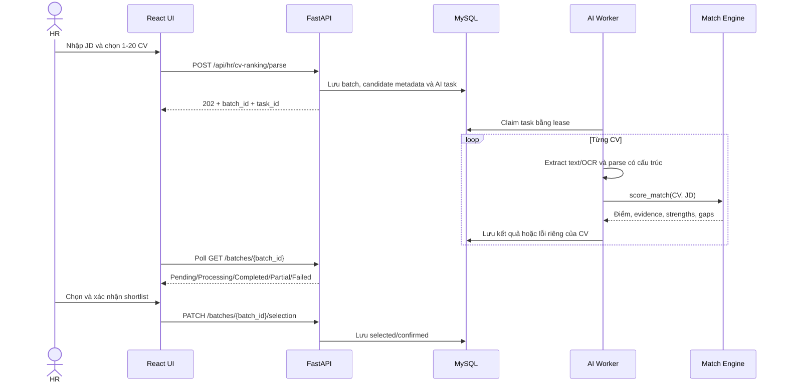
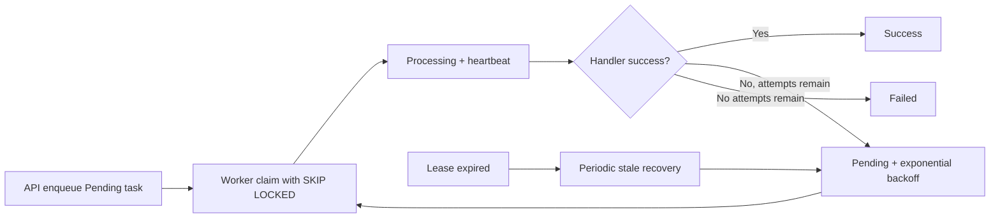
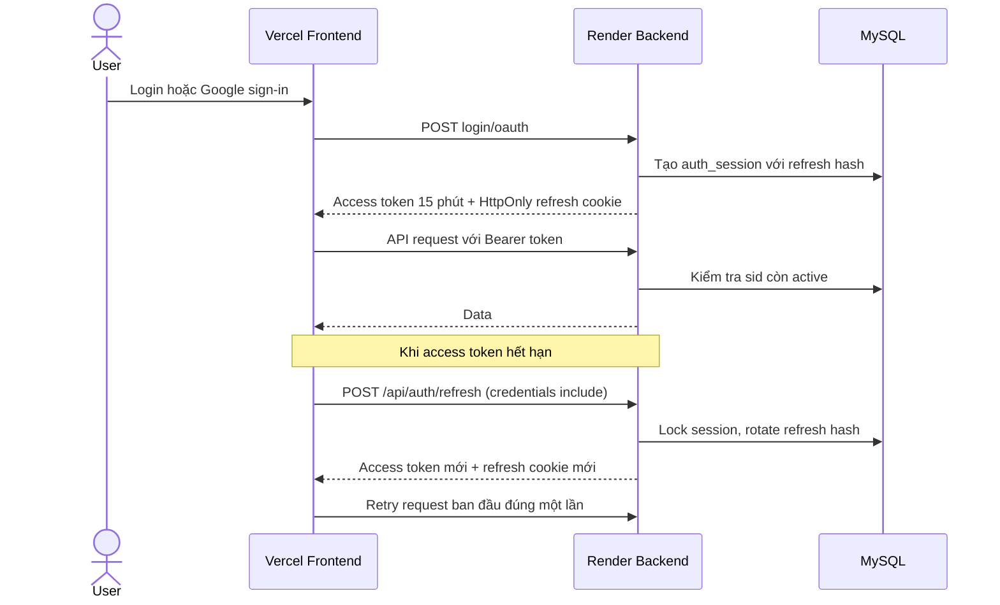

# Báo cáo KAN-220, KAN-224, KAN-228

Nhánh triển khai: `feature/kan-220-224-228-platform-hardening`

Baseline: `origin/main` tại commit `fe25627`.

## 1. Kết quả tổng quan

Ba epic đã được triển khai theo kiến trúc modular monolith hiện tại:

- HR Screening Batch được lưu trong MySQL, mở lại được sau reload, có tìm kiếm,
  lọc trạng thái/ngày/điểm, lưu lựa chọn và tải lại CV gốc.
- Các tác vụ CV parse, matching, application analysis, improvement và screening
  chạy qua hàng đợi `ai_task`, có idempotency, retry, heartbeat, lease và recovery.
- Auth dùng access token 15 phút kết hợp refresh token HttpOnly cookie; refresh
  token được xoay, logout/reset thu hồi session, endpoint nhạy cảm có rate limit.
- Công thức chấm điểm không bị tách nhánh mới. Screening vẫn gọi
  `backend/app/services/match_engine.py::score_match()`.

## 2. Truy vết Jira sang source

| Jira | Đã thực hiện | File chính |
|---|---|---|
| KAN-221 | Thêm schema batch/candidate, company scope, trạng thái và shortlist | `database/migrations/010_add_platform_hardening.sql`, `database/full_schema.sql`, `backend/app/models/platform.py` |
| KAN-222 | API tạo 202, reload, lưu selection, tải CV; frontend poll và mở batch cũ | `backend/app/api/routes/cv_ranking.py`, `backend/app/services/cv_ranking_service.py`, `src/api/cvRankingApi.ts`, `src/ui/screens/BulkCvRankingPanel.tsx` |
| KAN-223 | Filter theo từ khóa, status, khoảng ngày, điểm tối thiểu, limit/offset | `backend/app/repositories/screening_batches.py`, `backend/app/api/routes/cv_ranking.py` |
| KAN-225 | Mở rộng `ai_task` với ownership, payload, idempotency, retry và lease | `backend/app/models/improvement.py`, `backend/app/repositories/ai_tasks.py` |
| KAN-226 | Worker registry, heartbeat, retry backoff và terminal failure | `backend/app/services/ai_worker.py`, `backend/app/worker.py` |
| KAN-227 | Quét stale task định kỳ, status API và polling sau reload | `backend/app/api/routes/ai_tasks.py`, `backend/app/services/ai_task_service.py`, `src/api/cvRankingApi.ts` |
| KAN-229 | Session DB, access token có `sid`, rotate refresh cookie, frontend single-flight refresh | `backend/app/repositories/auth_sessions.py`, `backend/app/services/auth_service.py`, `src/api/httpClient.ts`, `src/app/App.tsx` |
| KAN-230 | MySQL-backed fixed-window rate limiting cho các auth action | `backend/app/services/auth_rate_limit.py`, `backend/app/api/routes/auth.py` |
| KAN-231 | Logout thu hồi session; reset password thu hồi toàn bộ session | `backend/app/api/deps.py`, `backend/app/api/routes/auth.py`, `backend/app/services/auth_service.py` |

## 3. Database

### Bảng mới

| Bảng | Mục đích | Điểm quan trọng |
|---|---|---|
| `hr_screening_batch` | Một phiên HR upload nhiều CV cho một JD | Thuộc `company_id`, lưu creator, tiến độ, status và JD snapshot |
| `hr_screening_candidate` | Một CV trong batch | Lưu file metadata, parsed result, score breakdown, lỗi riêng, selected/confirmed |
| `auth_session` | Phiên đăng nhập có thể thu hồi | Chỉ lưu SHA-256 hash refresh token, expiry, last use và revoke reason |
| `auth_rate_limit` | Counter chống brute force/abuse | Key được hash; lưu theo action và cửa sổ thời gian |

### `ai_task` được mở rộng

Các cột mới gồm owner/company, payload, idempotency key, số lần thử, thời điểm có
thể chạy lại, worker lock, heartbeat và updated timestamp. Index
`(status, available_at, created_at)` phục vụ claim task sẵn sàng.

Database đang chạy phải backup và chạy đúng một lần:

```sql
SOURCE database/migrations/010_add_platform_hardening.sql;
```

Database tạo mới bằng `database/full_schema.sql` không chạy migration này.

## 4. Workflow Screening Batch



Endpoint:

```text
POST  /api/hr/cv-ranking/parse
GET   /api/hr/cv-ranking/batches
GET   /api/hr/cv-ranking/batches/{batch_id}
PATCH /api/hr/cv-ranking/batches/{batch_id}/selection
GET   /api/hr/cv-ranking/batches/{batch_id}/candidates/{candidate_id}/cv
GET   /api/ai/tasks/{task_id}
```

`GET /batches` hỗ trợ `q`, `status`, `created_from`, `created_to`, `min_score`,
`limit`, `offset`. Mọi thao tác đều kiểm tra `company_id`.

## 5. Workflow AI Worker



Task type hiện được worker hỗ trợ:

- `CvParse`
- `MatchAnalysis`
- `ApplicationAnalysis`
- `ImprovementReport`
- `ScreeningBatch`

API production chỉ enqueue; không đồng thời chạy FastAPI `BackgroundTasks`, vì
như vậy có thể xử lý cùng một CV hai lần. Chế độ eager chỉ tồn tại trong pytest
để giữ tương thích với test integration cũ.

## 6. Workflow Auth và Session



- Access token nằm trong `sessionStorage`, không còn nằm trong `localStorage`.
- Khi nhiều request cùng trả `401`, frontend dùng một refresh promise chung.
- Khi mở tab mới, App bootstrap session từ HttpOnly cookie trước khi hiện Auth.
- Backend kiểm tra `Origin` cho refresh/logout.
- Local: `SameSite=Lax`, `REFRESH_COOKIE_SECURE=false`.
- Vercel -> Render: `SameSite=None; Secure`, `REFRESH_COOKIE_SECURE=true`.
- Logout có thể thu hồi bằng refresh cookie ngay cả khi access token đã hết hạn.
- Reset password thu hồi tất cả session của tài khoản.

Rate limit mặc định:

| Action | Giới hạn | Cửa sổ |
|---|---:|---:|
| Login | 5 | 15 phút |
| Register | 5 | 60 phút |
| Google OAuth | 10 | 15 phút |
| Forgot password | 5 | 15 phút |
| Verify reset code | 10 | 15 phút |
| Reset password | 10 | 15 phút |
| Refresh | 30 | 15 phút |

## 7. Cấu hình

Thêm vào `backend/.env` khi test local:

```env
ACCESS_TOKEN_EXPIRE_MINUTES=15
REFRESH_TOKEN_EXPIRE_DAYS=30
REFRESH_COOKIE_NAME=fitcv_refresh
REFRESH_COOKIE_SECURE=false
AI_WORKER_ENABLED=true
AI_WORKER_POLL_SECONDS=1
AI_WORKER_LEASE_SECONDS=1800
AI_WORKER_HEARTBEAT_SECONDS=30
AI_TASK_MAX_ATTEMPTS=3
```

Trên Render đổi `REFRESH_COOKIE_SECURE=true`. Nếu chạy worker tách riêng, Web
Service đặt `AI_WORKER_ENABLED=false`, còn Background Worker chạy:

```powershell
cd backend
python -m app.worker
```

## 8. Kiểm thử

Các test mới nằm trong `backend/tests/test_platform_hardening.py` và bao phủ:

- Persist, reload, filter và selection của screening batch.
- Retry đến terminal failure và stale lease recovery.
- Refresh rotation, logout revocation và auth rate limit.

Lệnh xác minh:

```powershell
cd backend
python -m pytest tests/test_platform_hardening.py tests/test_analyzer_improvement_integration.py tests/test_analyzer_services.py tests/test_application_workflow.py tests/test_cv_ranking_service.py -q

cd ..
npm test
npm run build
```

Kết quả verification cuối:

| Kiểm tra | Kết quả |
|---|---|
| Backend focused regression | `46 passed` |
| Backend full suite | `287 passed, 1 skipped, 1 failed` |
| Frontend Vitest | `14 files, 56 tests passed` |
| Frontend production build | Thành công, 7343 modules transformed |
| Python compileall | Thành công |
| FastAPI import/OpenAPI | Thành công, 72 paths |
| `git diff --check` | Không có whitespace error |

Failure còn lại là
`tests/test_application_tracker.py::TestApplicationTrackerApi::test_scheduled_and_stale_reminders`:
fixture mong `days_since_update == 31` nhưng source `main` trả `30` do cách làm
tròn khoảng thời gian. Các file KAN-220/224/228 không thay đổi phép tính này; lỗi
được giữ ngoài scope để teammate sở hữu Application Tracker xử lý riêng.

## 9. Hướng dẫn debug

### Batch đứng ở Pending

1. Kiểm tra có row `ai_task` với `task_type='ScreeningBatch'` hay không.
2. Kiểm tra `AI_WORKER_ENABLED=true` hoặc process `python -m app.worker` đang chạy.
3. Xem `available_at`, `attempt_count`, `locked_by`, `heartbeat_at` và
   `error_message`.
4. Nếu worker chết, task Processing sẽ được recovery sau lease timeout.

### Batch Partial hoặc Failed

Mở detail batch và đọc warning theo từng file. Lỗi OCR/parser được gắn vào đúng
`hr_screening_candidate`, không xóa kết quả các CV đã thành công.

### Refresh chạy local nhưng lỗi trên Vercel

1. Render phải có `REFRESH_COOKIE_SECURE=true`.
2. Domain Vercel chính xác phải nằm trong `CORS_ORIGINS`.
3. Request phải có `credentials: include`.
4. Kiểm tra response login có `Set-Cookie` với `SameSite=None; Secure`.
5. Không dùng HTTP cho production cookie Secure.

### Token còn hạn nhưng API trả 401

Kiểm tra `sid` trong JWT có row `auth_session` active không. Logout hoặc reset
password chủ động làm access token cũ mất hiệu lực ngay, dù trường `exp` chưa hết.

## 10. Giới hạn còn lại

- Migration `010` là forward migration, cần backup trước vì MySQL DDL tự commit.
- Metadata và kết quả batch nằm trong MySQL, nhưng file CV nằm dưới `UPLOAD_DIR`.
  Render production cần Persistent Disk hoặc private object storage; filesystem
  tạm của Web Service không đảm bảo file còn sau redeploy.
- MySQL queue phù hợp MVP. Khi số worker/task tăng mạnh mới cân nhắc Redis/RQ/Celery.
- Điểm AI chỉ hỗ trợ review; hệ thống không tự động nhận hoặc loại ứng viên.
